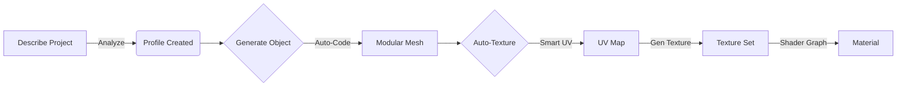

# ⚡ BlenderForge

> **The Ultimate AI Copilot for Blender.**  
> *Generate Code. Infer Styles. Create Textures. Build Worlds.*

---

## � What is BlenderForge?
BlenderForge turns natural language into production-ready 3D assets. It's not just a chat window—it's an **autonomous agent** that understands your project's art style, writes complex Python scripts, generates seamless textures, and builds shader graphs automatically.

---

## 🚀 Key Features

| Feature | Description |
| :--- | :--- |
| **🔧 Code AI** | Turns "Create a futuristic city" into **executed Python code**. Uses a **Multistep Planning Protocol** for complex objects (House, Car, Robot). |
| **🎯 Smart Profile** | Analyzes your project description to auto-infer **Art Style** (PBR/Toon/Retro), **Platform** (PC/Mobile), and **Shading Model**. |
| **🎨 Neural Textures** | Generates consistent, seamless textures. **HQ Mode** creates full PBR sets (BaseColor, Roughness, Normal, AO). |
| **✨ Smart UVs** | **Auto-detects geometry**: Applies *Cube Projection* for walls/floors and *Smart Project* for complex props. No more stretched textures! |
| **📚 Material Library** | **NEW!** Scans your scene for generated materials. reuse them instantly with one click. **Save API costs & time.** |
| **🎭 Shader Factory** | Auto-builds the perfect Node Tree: **PBR** (Principled), **Toon** (ShaderToRGB), or **Unlit** (Mobile). |

---

## �️ Installation

1.  **Get API Key**: [Google AI Studio](https://aistudio.google.com/) (Free tier available)
2.  **Install**: `Edit` → `Preferences` → `Add-ons` → `Install...` → Select `blenderforge.py`
3.  **Activate**: Check the box and paste your API Key.

---

## ⚡ Workflow: From Idea to Game Asset

### Example Run
1.  **Project**: "Cyberpunk slant, neon lights, rain-slicked streets."
2.  **Analyze**: System infers `Style: Realistic`, `Shading: PBR`, `Maps: All`.
3.  **Prompt**: "Create a sci-fi vending machine."
    *   *AI plans structure...*
    *   *AI builds mesh parts...*
4.  **Auto-Texture**:
    *   *UVs applied automatically.*
    *   *Textures generated (Neon, Metal, Glass).*
    *   *Material saved to Library.*

---

## 🎮 Command List

| Context | Prompt Idea | Result |
| :--- | :--- | :--- |
| **Character** | "Low-poly knight with separate armor parts" | Modular rig-ready character |
| **Prop** | "Old wooden crate, damaged" | Textured prop with roughness map |
| **Architecture** | "Modular dungeon wall 4x4m" | Tileable wall with Cube UVs |
| **Logic** | "Arrange selected objects in a circle" | Python script execution |

---

## ⚙️ Configuration

*   **Model**: Toggle between `Flash` (Speed) and `Pro` (Quality).
*   **HQ Mode**: Enable for full PBR Texture Sets (slower but stunning).
*   **Auto-Apply**: Textures are instantly applied to your selection.

---

*(c) 2026 BlenderForge Team. Built for the Future of 3D Creation.*
